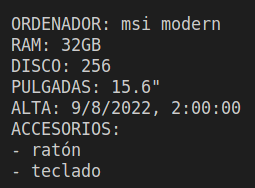

Crea un fichero llamado examen.js, el programa indicado a continuación. (8 puntos en total)

Función constructora

Se desea crear una función constructora para el objeto Ordenador.

El objeto tendrá las siguientes propiedades:

1. marca -> cadena

2. modelo ->cadena

3. ram ->número (por defecto 16)

4. disco -> número (por defecto 256)

5. pulgadas -> número (por defecto 15.6)

6. fecha -> cadena con formato válido que pueda entender la función Date.parse. Si la fecha no es válida (no sigue el formato indicado), se deberá almacenar la fecha actual en su lugar (valor por defecto)

7. accesorios -> número indeterminado de parámetros donde se espeficarán los accesorios del equipo

Condiciones (1 punto):

1. Si la marca no es un string el valor de la propiedad se asignará a 'no definida'

2. Si el modelo no es un string se le asignará a la propiedad del objeto el valor 'no definido' 

3. Si el valor de la ram no es numérico se le asignará 256

4. Si el valor de pulgadas no es numérico se le asignará 15.6

5. Si la fecha pasada no es un string o es un string pero con un formato no válido, se le asignará la fecha del momento en formato numérico.

Métodos (4,5 puntos):

1. mostrarOrdenador: Sin parámetros que devolverá lo siguiente: (0.5 puntos)

2. actualizarMarcaModelo: Con dos parámetros para actualizar ambas propiedades. (0,5 puntos)

3. actualizarRamDiscoPulgadas: Con tres parámetros para actualizar ambas propiedades. Si los parámetros no son números no actualizará las propiedades. Las comprobaciones serán individuales. (0.5 puntos)

4. actualizarFecha: Con un parámetro string en formato de fecha válido. Sólo actualizará la propiedad si el valor dado es válido.  (1 puntos)

5. anyadirAccesorios: Con un número de parámetros indefinido. Se añadirán los accesorios que se pasen controlando que no haya duplicados. (1 puntos)

6. borrarAccesorios: con número de parámetros indefinido. Se borrarán los accesorios pasados al método. (1 puntos)

Creación de objetos y programa principal

1. Objetos Ordenador: Crea 4 objetos ordenador con los siguientes parámetros:

('lenovo', 'legion', 32, 256, 15.6, '2022-11-09', 'ratón', 'teclado');
('hp', 'omen', 32, 256, 15.6, '2022-11-09', 'ratón', 'teclado');
('acer', 'ferrari', 32, 256, 15.6, '2022-09-09', 'ratón', 'teclado');
('msi', 'modern', 32, 256, 15.6, '2022-08-09', 'ratón', 'teclado');

Métodos de arrays (2,5 puntos):

1. Crea una variable global de tipo array, y almacena estos objetos, mediante métodos de array.

2. Muestra por pantalla todos los elementos del array, mediante el método mostrarOrdenador (0,5 puntos)

Se quiere, a partir del array global producir un objeto. Este objeto tendrá como propiedades las fechas de alta de todos los ordenadores.

Esas propiedades (fechas de alta) al principio tendrán como valor el número 1, si hay 2 ordenadores con la misma fecha de alta, el valor será 2. Usa el método de arrays apropiado y define la función que producirá ese objeto.

Muestra por pantalla el objeto producido. (2 puntos)

