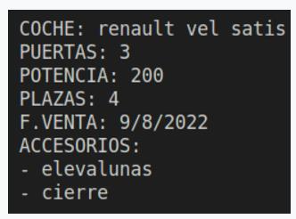

Crea en un fichero llamado examen.js, el programa indicado a continuación. Para entregarlo tendrás que comprimirlo en .zip

Función constructora y métodos
Se desea crear una función constructora para el objeto Coche. (propiedades y condiciones 1 punto)
La función constructora tendrá los siguientes parámetros que deberán ser validados de la siguiente manera (las propiedades del objeto se llamarán igual):

Los parámetros y las propiedades tendrán los mismos nombres:
1. marca -> cadena. Si la marca no es un string el valor de la propiedad se asignará a 'no definida'
2. modelo ->cadena. Si el modelo no es un string se le asignará a la propiedad del objeto el valor 'no definido'  
3. puertas ->número (por defecto 5). Si el valor no es numérico se le asignará 3 a la propiedad
4. potencia -> número (por defecto 120). Si el valor no es numérico se le asignará 120 a la propiedad
5. plazas -> número (por defecto 5). Si el valor no es numérico se le asignará 5 a la propiedad
6. fecha -> (fecha de venta) cadena con formato válido que pueda ser convertido a timestamp en la propiedad del mismo nombre . Si la fecha no es válida (no sigue el formato indicado), se deberá almacenar la fecha actual en la propiedad.
7. accesorios -> número indeterminado de parámetros donde se especificarán los accesorios del vehículo. Se deberán insertar en la propiedad los accesorios en minúsculas y sin duplicados.
(Hasta aquí 1 punto)
 
Métodos:  (2 puntos en total)

1. mostrarCoche: Sin parámetros que devolverá lo siguiente: (0'3 puntos)
   
   
2. actualizarMarcaModelo: Con dos parámetros para actualizar ambas propiedades. (0,1 puntos)
3. actualizarPuertasPotenciaPlazas: Recibirá un objeto con tres propiedades como parámetro. Si las propiedades del parámetro no son números no actualizará las propiedades internas del objeto (0,4 puntos)
4. actualizarFecha: Con un parámetro string en formato de fecha válido. Sólo actualizará la propiedad si el valor dado es válido.  (0,3 puntos)
5. anyadirAccesorios: Con un número de parámetros indefinido. Se añadirán los accesorios que se pasen controlando que no haya duplicados y en minúsculas. (0,3 puntos)
6. borrarAccesorios: con número de parámetros indefinido. Se borrarán los accesorios pasados al método convirtiéndolos a minúsculas. (0,5 puntos)
7. ordenarArrayAccesorios: sin parámetros, ordenará el array de accesorios. (0,1 puntos)
 
Creación de objetos y programa principal
1. Objetos Coche: Crea 4 objetos coche con los siguientes parámetros:
 
Código para copiarlo más rápido:
    Coche('citroën', 'c4', 4, 120, 5, '2022-11-09', 'elevalunas', 'cierre', 'climatizador');
    Coche('seat', 'ibiza', 5, 110, 5, '2022-11-09', 'elevalunas', 'cierre');
    Coche('audi', 'a4', 5, 180, 5, '2022-09-09', 'elevalunas', 'cierre');
    Coche('renault', 'vel satis', 3, 200, 4, '2022-08-09', 'elevalunas', 'cierre');
    
Métodos de arrays
1. Crea una variable global de tipo array, y almacena estos objetos, mediante métodos de array.
2. Muestra por pantalla todos los elementos del array, mediante el método mostrarCoche (1 punto)
3. Se quiere, a partir del array global producir un objeto. Este objeto tendrá como propiedades las fechas de venta de todos los coches.(3 puntos)

Esas propiedades (fechas de venta) al principio tendrán como valor el número 1, si hay 2 coches con la misma fecha de venta, el valor será 2. Usa el método de arrays apropiado y define la función que producirá ese objeto.
Muestra por pantalla el objeto producido. (3 puntos)

4. Crear la función filtrarCoche, que recibirá como parámetro un objeto con las propiedades: mark, model, npuertas, potDesde, nplazas, acces 
*la propiedad mark servirá para filtrar los coches que coincidan con esa marca
*la propiedad model servirá par filtrarlos por modelo,  npuertas, por el número de puertas, potDesde, para filtrar coches con potencias iguales o superiores a dicha propiedad, nplazas para filtrar coches con un nº determinado de plazas
*La propiedad acces filtrará coches que incluyan en su propiedad accesorios ese elemento (3 puntos)